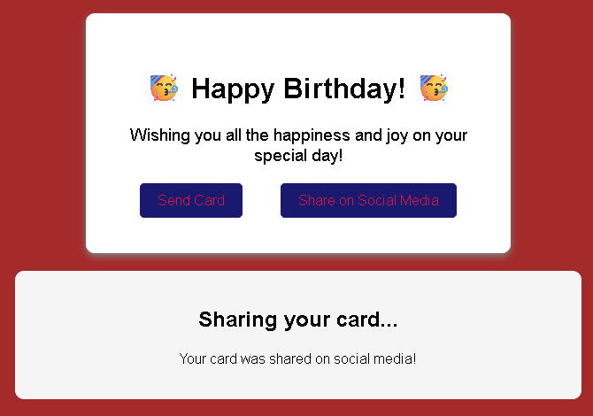

# 📬 Greeting Card

Welcome! This is a practical project developed as part of the **freeCodeCamp** curriculum. It features an interactive greeting card designed exclusively with **HTML5** and **CSS3**, focusing on advanced selectors and smooth animations without relying on JavaScript.

---

## 🚀 Features & Concepts Learned

The main goal of this project was to master visual interactivity and semantic structure in Frontend web development. The key pillars applied are:

### 🔹 Pseudo-elements (`::before` and `::after`)
* Used to add decorative elements and visual layers directly from CSS, keeping the HTML file clean and semantic.
* Ideal for background effects, textures, and geometric details within the card.

### 🔹 Pseudo-classes / Pseudo-selectors (`:hover`, `:focus`)
* Implemented to detect user interaction.
* They allow the card to react dynamically when the cursor hovers over it or when its elements are focused.

### 🔹 Transitions & Transformations (`transition` & `transform`)
* **`transform`:** Applied to modify the elements in a 2D space (scaling, rotating, or translating the card and its components during interaction).
* **`transition`:** Defines the duration and speed curve of the changes (e.g., `ease-in-out`), ensuring that movements are not abrupt, but entirely smooth and organic animations.

---

## 🛠️ Technologies Used

* **HTML5:** Semantic structuring of the card's content.
* **CSS3:** Custom styling, responsive design, pseudo-elements, and smooth animations.

---

## 📸 Demonstration

To see the card in action and interact with the transition animations:

  

* **Live Demo:** [View Project on GitHub Pages](https://josuevasquez2305.github.io/Gretting-card-fcc)

---

## ✒️ Author

* **JosueVasquez2305** - [*GitHub Profile*](https://github.com/JosueVasquez2305)